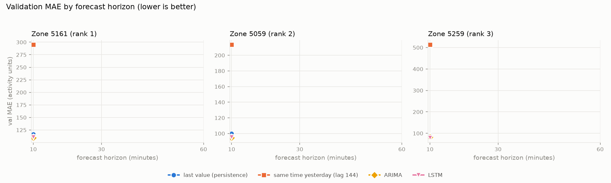

# 밀라노 모바일 트래픽 예측 → 용량 셀 켜기/끄기

밀라노 인터넷 트래픽이 가장 많은 격자 칸 3곳에서 **10·30·60분 뒤 트래픽**을 예측하고, 그 예측으로
**혼잡이 오기 전에 용량 셀을 켜는 운용 규칙**이 얼마나 잘 동작하는지 평가한 개인 실험입니다.
단순 기준선 → ARIMA → LSTM을 같은 데이터·같은 전처리·같은 test 구간에서 비교했고,
test(2013-12-16 ~ 12-22)는 모든 설정을 val로 확정한 뒤 **한 번만** 평가했습니다(`results/test/LOCK`).

## 결과 요약 (test, 한 번 평가)

**예측 오차** — 상대 MAE(어제 같은 시각의 MAE = 1, 세 구역 평균, 낮을수록 좋음)

| 계열 | 10분 뒤 | 30분 뒤 | 60분 뒤 |
|---|---|---|---|
| 어제 같은 시각 | 1.000 | 1.000 | 1.000 |
| 마지막 관측값 | 0.303 | 0.514 | 0.914 |
| 지난주 같은 시각 | 0.950 | 0.950 | 0.950 |
| ARIMA | 0.284 | 0.430 | 0.687 |
| LSTM | **0.284** | **0.387** | **0.521** |

- 60분 뒤 LSTM의 오차는 어제 같은 시각의 52%, 마지막 관측값(91%)보다 크게 낮습니다. 거리가 멀수록 모델의 이점이 커집니다.
- 10분 뒤에는 모델과 "마지막 관측값"의 MAE 차이가 -7.8~-0.4로 작고, 구역에 따라 95% 구간이 0을 포함합니다(아래 표). 60분 뒤 LSTM은 세 구역 모두 구간이 0 미만입니다.

**마지막 관측값 대비 MAE 차이와 95% 구간**(일별 블록 부트스트랩, ✔ = 구간 전체가 0 미만)

| 거리 | 계열 | 구역 5161 | 구역 5059 | 구역 5259 |
|---|---|---|---|---|
| 10분 | ARIMA | -2.9 [-6.6, 0.8] | -5.9 [-8.4, -3.8] ✔ | -6.9 [-10.3, -4.0] ✔ |
| 10분 | LSTM | -0.4 [-5.7, 5.3] | -7.8 [-12.8, -3.2] ✔ | -6.2 [-14.4, 2.0] |
| 30분 | ARIMA | -29.2 [-38.5, -18.2] ✔ | -19.0 [-22.1, -15.7] ✔ | -25.3 [-35.5, -15.0] ✔ |
| 30분 | LSTM | -42.6 [-56.3, -28.7] ✔ | -32.6 [-41.1, -23.8] ✔ | -30.1 [-58.2, 0.7] |
| 60분 | ARIMA | -82.6 [-99.8, -63.7] ✔ | -55.5 [-61.3, -49.1] ✔ | -52.9 [-73.0, -32.0] ✔ |
| 60분 | LSTM | -150.9 [-185.6, -115.3] ✔ | -97.2 [-112.9, -78.9] ✔ | -78.9 [-134.7, -14.6] ✔ |

**60분 뒤 예측으로 용량 셀 켜기/끄기** — 세 구역 합계, 켜는 데 걸리는 시간 0분

| 계열 | 조합(val에서 선택) | 놓친 혼잡 시간 | 놓친 혼잡 | 켜 둔 시간 | 켜고 끈 횟수 |
|---|---|---|---|---|---|
| 어제 같은 시각 | H 30분·1.0θ | 1030분 | 12/19 | 5,650분 | 22회 |
| 마지막 관측값 | H 30분·1.0θ | 840분 | 17/19 | 5,240분 | 24회 |
| 지난주 같은 시각 | H 60분·1.0θ | 30분 | 2/19 | 7,200분 | 24회 |
| ARIMA | H 30분·1.0θ | 280분 | 11/19 | 6,100분 | 25회 |
| LSTM | H 0분·1.0θ | 407분 | 9/19 | 5,423분 | 15회 |
| (참고) 미래를 아는 경우 | 기준선 | 0분 | 0/19 | 5,100분 | 28회 |
| (참고) 항상 켬 | 기준선 | 0분 | 0/19 | 30,240분 | 3회 |

- LSTM은 켜고 끄는 횟수가 가장 적고(15회) 켜 둔 시간이 미래를 아는 경우보다 6% 길 뿐이지만, 놓친 혼잡 시간(407분)은 ARIMA(280분)보다 깁니다.
- 지난주 같은 시각은 혼잡을 거의 놓치지 않지만(30분) 셀을 미래를 아는 경우보다 41% 더 오래 켜 둡니다. **놓침 1분의 비용을 켜 둔 시간 몇 분으로 볼지에 따라 순위가 바뀝니다(아래 표).**

**놓침 비용 비율에 따른 순위 (사후 민감도 분석)** — 비용 = w × 놓친 혼잡 시간 + 켜 둔 시간, w = 놓침 1분이 켜 둔 몇 분만큼 비싼가. 60분 뒤, 지연 0분, 세 구역 합계.

| | val (선택용) | test (한 번 평가) |
|---|---|---|
| 비용이 가장 낮은 계열 | w < 1.6: 지난주 같은 시각<br>1.6 ~ 20.9: LSTM<br>w > 20.9: ARIMA | w < 0.4: 마지막 관측값<br>0.4 ~ 4.7: LSTM<br>w > 4.7: 지난주 같은 시각 |

- 이 표는 test 결과를 본 뒤 추가한 분석입니다. 셀 용량의 절대 비용을 몰라 w를 하나로 정하지 않고, w 범위별 결과를 보고합니다.
- **LSTM은 w가 약 1.6~4.7일 때 val과 test 모두에서 비용이 가장 낮습니다.** 놓침을 그보다 더 무겁게 보면 test에서는 지난주 같은 시각이 앞섭니다.
- 다만 지난주 같은 시각의 놓친 혼잡 시간은 val 910분, test 30분으로 주마다 크게 흔들렸습니다. test 주의 혼잡 시간대가 바로 전 주와 비슷했던 영향으로 보이며, 한 주의 결과로 일반화하기 어렵습니다.
- 켜고 끄는 횟수의 비용은 넣지 않았습니다.

- 전체 표: [test 결과](results/test/metrics.md), [켜기/끄기(test)](results/test/switching.csv), [거리별 비교(val)](results/horizon.md), [켜기/끄기 후보 전체(val)](results/switching.md)



## 데이터
- Telecom Italia, "Telecommunications - SMS, Call, Internet - MI", Harvard Dataverse, DOI [10.7910/DVN/EGZHFV](https://doi.org/10.7910/DVN/EGZHFV). 10분 간격, 10,000개 격자.
- `CellID`는 무선 셀이 아니라 약 235m 격자 칸입니다. 이 실험은 **지역별 수요 예측**입니다.
- 값은 절대량이 아니라 스케일된 활동량이라 단위 없이 비교만 합니다.
- 구역: train 기간 인터넷 총량 상위 3곳(5161, 5059, 5259). 국가 코드별 행을 합산했습니다.

## 방법
- **분할(시간순, Europe/Rome):** train 11/01~12/08, val 12/09~12/15, test 12/16~12/22. 개발 단계(dev)는 11/04~11/17만 사용했습니다.
- **결측:** 연속 30분 이하는 직전 값으로 채우고(`is_imputed`), 채운 시각은 채점과 학습 손실에서 뺍니다. 이번 데이터에는 결측이 없었습니다.
- **예측 거리 h(10·30·60분):** 대상 시각 t를 t − h까지의 관측만으로 예측합니다. 기준선은 y[t − max(lag, h)], ARIMA는 train에서 적합한 파라미터로 h스텝 앞 예측(재적합 없음), LSTM은 거리마다 따로 학습합니다.
- **한 실험에 한 요소:** 모든 실험은 부모 실험에서 설정 키를 정확히 하나만 바꾸고, 바꾼 이유와 가설을 적습니다. 이 규칙은 코드가 강제합니다.
- **선택:** (구역, 거리, 계열)마다 val MAE가 가장 낮은 실험. test에 쓴 목록은 [`configs/final.yaml`](configs/final.yaml).
- **결정 지표:** 혼잡 임계치 θ = 0.7 × 구역별 train 99번째 백분위수. 예측 ≥ θ이면 경보, 혼잡이 시작되기 **전에** 나온 경보만 탐지로 인정합니다.
- **켜기/끄기 규칙:** 예측이 켜기 기준 이상이면 켜고, 최소 H분 유지한 뒤 기준 아래면 끕니다. 후보(H 0·30·60·120분 × 기준 1.0·0.9·0.8θ)는 미리 고정했고, val에서 "켜 둔 시간이 3단계 경보의 1.2배 이하인 조합 중 놓침 최소"로 골라 test에 그대로 적용했습니다.
- 모든 결정과 그 이유, 중간에 바뀐 설계(예: 선택 규칙 r1 → s1)는 [기획서](docs/traffic-predict_기획서.md)의 "설계 결정 기록"에 있습니다.

## 한계
- **val은 선택용이라 편향됨:** val은 설정을 고르는 데 썼으므로 val 수치는 낙관적입니다. 조기 종료까지 val로 한 LSTM은 더 편향됩니다. 공정한 비교는 test뿐입니다.
- **모든 모델은 train으로만 학습:** test 전에 train+val로 다시 학습하지 않았습니다. 계열 간 조건은 같지만 최신 1주를 학습에 쓰지 않았습니다.
- **공휴일:** train에 공휴일(11/01, 12/07, 12/08)이 섞여 있습니다.
- **test는 성탄 직전 쇼핑 주간:** 평소 주와 다를 수 있습니다.
- **부트스트랩 블록이 7개뿐:** test가 7일이라 신뢰구간이 거칩니다. 결정 지표와 켜기/끄기는 혼잡 구간 19개에 기반해 구간 없이 값만 보고합니다.
- 30·60분 실험은 10분 뒤에서 고른 하이퍼파라미터를 그대로 썼습니다. 셀 용량은 절대 단위를 몰라 train 피크 대비 비율로 가정했습니다.

## 재현
```bash
uv sync
# 원본 일별 파일(sms-call-internet-mi-2013-11-01.txt ~ 12-22)을 data/raw/ 또는 TP_RAW_DIR에 둡니다(.txt.gz도 가능)
uv run python -m tp prepare --phase full
uv run python -m tp run --config configs/experiments/EXP-013.yaml   # experiments/를 비운 작업 사본에서, EXP-001부터 순서대로
uv run python -m tp results
uv run pytest -q
```
- 시드: LSTM은 0·1·2(실험마다 다시 고정), naive·ARIMA는 시드를 쓰지 않습니다. CPU 전용, 결정적 연산.
- 기대 값: EXP-013(full, 어제 같은 시각) val MAE 294.8942, EXP-001(dev, 같은 모델) val MAE 503.7637. naive·ARIMA는 1e-9, LSTM은 같은 시드에서 1e-6 이내로 같게 나와야 합니다(같은 머신 기준, 다른 머신은 상대 1e-3).
- test는 `results/test/LOCK` 때문에 다시 실행되지 않습니다.

## 실험 기록
각 실험 폴더에는 설정(`config.yaml`), 이유·가설·시드·커밋(`meta.json`), 지표(`metrics.json`), 예측, 학습 곡선이 있습니다.
EXP-001~012는 dev 단계(구역 5259, 10분 뒤), EXP-013 이후는 full 단계입니다. EXP-015는 ARIMA(5,1,5) 수렴 실패로 EXP-017(2,1,2)로 대체했습니다.

<details>
<summary>전체 실험 58개</summary>

| 실험 | 단계 | 바꾼 요소 | 모델 | 거리 | 구역 | val MAE | 상태 | 바꾼 이유 |
|---|---|---|---|---|---|---|---|---|
| [EXP-001](experiments/EXP-001_lag144/) | dev | (루트) | naive | 10분 | 5259 | 503.8 | 완료 | dev 단계 루트. 공식 기준선(전날 같은 시각)을 먼저 세워 이후 모든 dev 실험의 비교 기준으로 삼는다 |
| [EXP-002](experiments/EXP-002_lag1/) | dev | `naive.lag` | naive | 10분 | 5259 | 101.4 | 완료 | 10분 뒤 예측에서 가장 강한 단순 기준선(직전 값)을 참고 기준선으로 함께 보고한다 |
| [EXP-003](experiments/EXP-003_arima-212/) | dev | `model.type` | arima | 10분 | 5259 | 94.2 | 완료 | 비교 순서(seasonal naive → ARIMA → LSTM)의 두 번째 계열. 초기 설정 ARIMA(2,1,2), 계절성 처리 없이 시작한다 |
| [EXP-004](experiments/EXP-004_arima-seasonal-diff144/) | dev | `arima.seasonal` | arima | 10분 | 5259 | 142.4 | 완료 | EXP-003(계절성 없음)은 평일 전환 구간 오차가 남음. 하루 주기를 모델에 넣는 두 방식을 한 요소씩 비교한다 |
| [EXP-005](experiments/EXP-005_arima-seasonal-fourier/) | dev | `arima.seasonal` | arima | 10분 | 5259 | 105.9 | 완료 | EXP-003(계절성 없음)은 평일 전환 구간 오차가 남음. 하루 주기를 모델에 넣는 두 방식을 한 요소씩 비교한다 |
| [EXP-006](experiments/EXP-006_arima-202-diff144/) | dev | `arima.order` | arima | 10분 | 5259 | 142.4 | 완료 | EXP-004(diff144, d=1)는 계절 차분 위에 차분을 한 번 더 해 과차분으로 추정됨(토요일 MAE 186). 계절 차분만 남기려고 d를 1에서 0으로 바꾼다 |
| [EXP-007](experiments/EXP-007_arima-order-1-1-1/) | dev | `arima.order` | arima | 10분 | 5259 | 98.4 | 완료 | 계절성 추가(EXP-004~006)는 도움이 안 됐으므로 계절성 없는 EXP-003을 기준으로 차수만 바꿔 ARIMA 계열의 최선을 확정한다 |
| [EXP-008](experiments/EXP-008_arima-order-3-1-3/) | dev | `arima.order` | arima | 10분 | 5259 | 95.1 | 완료 | 계절성 추가(EXP-004~006)는 도움이 안 됐으므로 계절성 없는 EXP-003을 기준으로 차수만 바꿔 ARIMA 계열의 최선을 확정한다 |
| [EXP-009](experiments/EXP-009_arima-order-5-1-5/) | dev | `arima.order` | arima | 10분 | 5259 | 93.8 | 완료 | 계절성 추가(EXP-004~006)는 도움이 안 됐으므로 계절성 없는 EXP-003을 기준으로 차수만 바꿔 ARIMA 계열의 최선을 확정한다 |
| [EXP-010](experiments/EXP-010_lstm-init/) | dev | `model.type` | lstm | 10분 | 5259 | 107.4 | 완료 | 비교 순서(seasonal naive → ARIMA → LSTM)의 세 번째 계열. 기획서 4.2 초기 설정으로 시작한다 |
| [EXP-011](experiments/EXP-011_lstm-epochs100/) | dev | `lstm.max_epochs` | lstm | 10분 | 5259 | 103.0 | 완료 | EXP-010은 세 시드 모두 best epoch가 47~50/50으로 제한 직전까지 val 손실이 조금씩 줄고 있었다. 학습이 덜 끝났는지 확인하려고 최대 에폭만 50에서 100으로 늘린다 |
| [EXP-012](experiments/EXP-012_lstm-window24/) | dev | `lstm.window` | lstm | 10분 | 5259 | 114.1 | 완료 | ARIMA 실험(EXP-003~009)에서 10분 뒤 예측은 최근 흐름이 대부분을 설명했다. LSTM 입력 창을 지난 하루(144칸)에서 지난 4시간(24칸)으로 줄여 같은 교훈이 LSTM에도 맞는지 확인한다 |
| [EXP-013](experiments/EXP-013_full-lag144/) | full | (루트) | naive | 10분 | 5161 | 294.9 | 완료 | full 단계 루트. 공식 기준선(전날 같은 시각)을 full 구간(train 11/01~12/08, val 12/09~12/15)에서 다시 세운다 |
| [EXP-014](experiments/EXP-014_full-lag1/) | full | `naive.lag` | naive | 10분 | 5161 | 116.8 | 완료 | 참고 기준선(직전 값)을 full 구간에서 다시 잰다. dev에서 실질적인 비교 기준이었다 |
| [EXP-015](experiments/EXP-015_full-arima-515/) | full | `phase` | arima | 10분 | 5161 |  | 실패 | dev ARIMA 최선(EXP-009, (5,1,5) 계절성 없음, val MAE 93.82)을 설정 그대로 full로 옮긴다 |
| [EXP-016](experiments/EXP-016_full-lstm-init-e100/) | full | `phase` | lstm | 10분 | 5161 | 110.8 | 완료 | dev LSTM 최선(EXP-011, window 144, max_epochs 100, val MAE 103.01)을 설정 그대로 full로 옮긴다. dev의 주말 약점이 데이터 부족 때문인지 검증한다 |
| [EXP-017](experiments/EXP-017_full-arima-212/) | full | `phase` | arima | 10분 | 5161 | 109.5 | 완료 | dev 최선 ARIMA를 옮긴 EXP-015((5,1,5))가 full 구역 5161에서 최적화 반복 상한(200회)에 걸려 E-3001로 실패했다. dev 차선이자 차이 0.4%로 구분되지 않던 EXP-003((2,1,2))을 설정 그대로 옮긴다 |
| [EXP-018](experiments/EXP-018_z-lag144-2/) | full | `zone_rank` | naive | 10분 | 5059 | 213.4 | 완료 | F-11: 구역 1(5161)의 최종 설정을 그대로 2위(5059)·3위(5259) 구역에 적용해, 결론이 한 구역만의 특성인지 확인한다 |
| [EXP-019](experiments/EXP-019_z-lag144-3/) | full | `zone_rank` | naive | 10분 | 5259 | 513.1 | 완료 | F-11: 구역 1(5161)의 최종 설정을 그대로 2위(5059)·3위(5259) 구역에 적용해, 결론이 한 구역만의 특성인지 확인한다 |
| [EXP-020](experiments/EXP-020_z-lag1-2/) | full | `zone_rank` | naive | 10분 | 5059 | 99.9 | 완료 | F-11: 구역 1(5161)의 최종 설정을 그대로 2위(5059)·3위(5259) 구역에 적용해, 결론이 한 구역만의 특성인지 확인한다 |
| [EXP-021](experiments/EXP-021_z-lag1-3/) | full | `zone_rank` | naive | 10분 | 5259 | 89.9 | 완료 | F-11: 구역 1(5161)의 최종 설정을 그대로 2위(5059)·3위(5259) 구역에 적용해, 결론이 한 구역만의 특성인지 확인한다 |
| [EXP-022](experiments/EXP-022_z-arima212-2/) | full | `zone_rank` | arima | 10분 | 5059 | 94.6 | 완료 | F-11: 구역 1(5161)의 최종 설정을 그대로 2위(5059)·3위(5259) 구역에 적용해, 결론이 한 구역만의 특성인지 확인한다 |
| [EXP-023](experiments/EXP-023_z-arima212-3/) | full | `zone_rank` | arima | 10분 | 5259 | 82.6 | 완료 | F-11: 구역 1(5161)의 최종 설정을 그대로 2위(5059)·3위(5259) 구역에 적용해, 결론이 한 구역만의 특성인지 확인한다 |
| [EXP-024](experiments/EXP-024_z-lstm-2/) | full | `zone_rank` | lstm | 10분 | 5059 | 95.3 | 완료 | F-11: 구역 1(5161)의 최종 설정을 그대로 2위(5059)·3위(5259) 구역에 적용해, 결론이 한 구역만의 특성인지 확인한다 |
| [EXP-025](experiments/EXP-025_z-lstm-3/) | full | `zone_rank` | lstm | 10분 | 5259 | 79.3 | 완료 | F-11: 구역 1(5161)의 최종 설정을 그대로 2위(5059)·3위(5259) 구역에 적용해, 결론이 한 구역만의 특성인지 확인한다 |
| [EXP-026](experiments/EXP-026_z1-lag-1008/) | full | `naive.lag` | naive | 10분 | 5161 | 214.3 | 완료 | v2 기준선 추가: 지난주 같은 시각(lag-1008). 요일을 반영하는 단순 기준선이 필요함(어제 같은 시각은 요일 전환일에 크게 틀림) |
| [EXP-027](experiments/EXP-027_z2-lag-1008/) | full | `naive.lag` | naive | 10분 | 5059 | 203.4 | 완료 | v2 기준선 추가: 지난주 같은 시각(lag-1008). 요일을 반영하는 단순 기준선이 필요함(어제 같은 시각은 요일 전환일에 크게 틀림) |
| [EXP-028](experiments/EXP-028_z3-lag-1008/) | full | `naive.lag` | naive | 10분 | 5259 | 184.8 | 완료 | v2 기준선 추가: 지난주 같은 시각(lag-1008). 요일을 반영하는 단순 기준선이 필요함(어제 같은 시각은 요일 전환일에 크게 틀림) |
| [EXP-029](experiments/EXP-029_lag1-z1-3/) | full | `horizon` | naive | 30분 | 5161 | 200.8 | 완료 | v2 예측 거리 확장: 10분 뒤 최선 설정을 그대로 30·60분 뒤에 적용해 거리별로 비교한다(용량 셀을 미리 켜려면 먼 거리 예측이 필요) |
| [EXP-030](experiments/EXP-030_lag1-z1-6/) | full | `horizon` | naive | 60분 | 5161 | 349.1 | 완료 | v2 예측 거리 확장: 10분 뒤 최선 설정을 그대로 30·60분 뒤에 적용해 거리별로 비교한다(용량 셀을 미리 켜려면 먼 거리 예측이 필요) |
| [EXP-031](experiments/EXP-031_lag1-z2-3/) | full | `horizon` | naive | 30분 | 5059 | 157.2 | 완료 | v2 예측 거리 확장: 10분 뒤 최선 설정을 그대로 30·60분 뒤에 적용해 거리별로 비교한다(용량 셀을 미리 켜려면 먼 거리 예측이 필요) |
| [EXP-032](experiments/EXP-032_lag1-z2-6/) | full | `horizon` | naive | 60분 | 5059 | 259.1 | 완료 | v2 예측 거리 확장: 10분 뒤 최선 설정을 그대로 30·60분 뒤에 적용해 거리별로 비교한다(용량 셀을 미리 켜려면 먼 거리 예측이 필요) |
| [EXP-033](experiments/EXP-033_lag1-z3-3/) | full | `horizon` | naive | 30분 | 5259 | 148.7 | 완료 | v2 예측 거리 확장: 10분 뒤 최선 설정을 그대로 30·60분 뒤에 적용해 거리별로 비교한다(용량 셀을 미리 켜려면 먼 거리 예측이 필요) |
| [EXP-034](experiments/EXP-034_lag1-z3-6/) | full | `horizon` | naive | 60분 | 5259 | 252.3 | 완료 | v2 예측 거리 확장: 10분 뒤 최선 설정을 그대로 30·60분 뒤에 적용해 거리별로 비교한다(용량 셀을 미리 켜려면 먼 거리 예측이 필요) |
| [EXP-035](experiments/EXP-035_lag144-z1-3/) | full | `horizon` | naive | 30분 | 5161 | 294.9 | 완료 | v2 예측 거리 확장: 10분 뒤 최선 설정을 그대로 30·60분 뒤에 적용해 거리별로 비교한다(용량 셀을 미리 켜려면 먼 거리 예측이 필요) |
| [EXP-036](experiments/EXP-036_lag144-z1-6/) | full | `horizon` | naive | 60분 | 5161 | 294.9 | 완료 | v2 예측 거리 확장: 10분 뒤 최선 설정을 그대로 30·60분 뒤에 적용해 거리별로 비교한다(용량 셀을 미리 켜려면 먼 거리 예측이 필요) |
| [EXP-037](experiments/EXP-037_lag144-z2-3/) | full | `horizon` | naive | 30분 | 5059 | 213.4 | 완료 | v2 예측 거리 확장: 10분 뒤 최선 설정을 그대로 30·60분 뒤에 적용해 거리별로 비교한다(용량 셀을 미리 켜려면 먼 거리 예측이 필요) |
| [EXP-038](experiments/EXP-038_lag144-z2-6/) | full | `horizon` | naive | 60분 | 5059 | 213.4 | 완료 | v2 예측 거리 확장: 10분 뒤 최선 설정을 그대로 30·60분 뒤에 적용해 거리별로 비교한다(용량 셀을 미리 켜려면 먼 거리 예측이 필요) |
| [EXP-039](experiments/EXP-039_lag144-z3-3/) | full | `horizon` | naive | 30분 | 5259 | 513.1 | 완료 | v2 예측 거리 확장: 10분 뒤 최선 설정을 그대로 30·60분 뒤에 적용해 거리별로 비교한다(용량 셀을 미리 켜려면 먼 거리 예측이 필요) |
| [EXP-040](experiments/EXP-040_lag144-z3-6/) | full | `horizon` | naive | 60분 | 5259 | 513.1 | 완료 | v2 예측 거리 확장: 10분 뒤 최선 설정을 그대로 30·60분 뒤에 적용해 거리별로 비교한다(용량 셀을 미리 켜려면 먼 거리 예측이 필요) |
| [EXP-041](experiments/EXP-041_lag1008-z1-3/) | full | `horizon` | naive | 30분 | 5161 | 214.3 | 완료 | v2 예측 거리 확장: 10분 뒤 최선 설정을 그대로 30·60분 뒤에 적용해 거리별로 비교한다(용량 셀을 미리 켜려면 먼 거리 예측이 필요) |
| [EXP-042](experiments/EXP-042_lag1008-z1-6/) | full | `horizon` | naive | 60분 | 5161 | 214.3 | 완료 | v2 예측 거리 확장: 10분 뒤 최선 설정을 그대로 30·60분 뒤에 적용해 거리별로 비교한다(용량 셀을 미리 켜려면 먼 거리 예측이 필요) |
| [EXP-043](experiments/EXP-043_lag1008-z2-3/) | full | `horizon` | naive | 30분 | 5059 | 203.4 | 완료 | v2 예측 거리 확장: 10분 뒤 최선 설정을 그대로 30·60분 뒤에 적용해 거리별로 비교한다(용량 셀을 미리 켜려면 먼 거리 예측이 필요) |
| [EXP-044](experiments/EXP-044_lag1008-z2-6/) | full | `horizon` | naive | 60분 | 5059 | 203.4 | 완료 | v2 예측 거리 확장: 10분 뒤 최선 설정을 그대로 30·60분 뒤에 적용해 거리별로 비교한다(용량 셀을 미리 켜려면 먼 거리 예측이 필요) |
| [EXP-045](experiments/EXP-045_lag1008-z3-3/) | full | `horizon` | naive | 30분 | 5259 | 184.8 | 완료 | v2 예측 거리 확장: 10분 뒤 최선 설정을 그대로 30·60분 뒤에 적용해 거리별로 비교한다(용량 셀을 미리 켜려면 먼 거리 예측이 필요) |
| [EXP-046](experiments/EXP-046_lag1008-z3-6/) | full | `horizon` | naive | 60분 | 5259 | 184.8 | 완료 | v2 예측 거리 확장: 10분 뒤 최선 설정을 그대로 30·60분 뒤에 적용해 거리별로 비교한다(용량 셀을 미리 켜려면 먼 거리 예측이 필요) |
| [EXP-047](experiments/EXP-047_arima-z1-3/) | full | `horizon` | arima | 30분 | 5161 | 165.3 | 완료 | v2 예측 거리 확장: 10분 뒤 최선 설정을 그대로 30·60분 뒤에 적용해 거리별로 비교한다(용량 셀을 미리 켜려면 먼 거리 예측이 필요) |
| [EXP-048](experiments/EXP-048_arima-z1-6/) | full | `horizon` | arima | 60분 | 5161 | 257.8 | 완료 | v2 예측 거리 확장: 10분 뒤 최선 설정을 그대로 30·60분 뒤에 적용해 거리별로 비교한다(용량 셀을 미리 켜려면 먼 거리 예측이 필요) |
| [EXP-049](experiments/EXP-049_arima-z2-3/) | full | `horizon` | arima | 30분 | 5059 | 133.7 | 완료 | v2 예측 거리 확장: 10분 뒤 최선 설정을 그대로 30·60분 뒤에 적용해 거리별로 비교한다(용량 셀을 미리 켜려면 먼 거리 예측이 필요) |
| [EXP-050](experiments/EXP-050_arima-z2-6/) | full | `horizon` | arima | 60분 | 5059 | 198.6 | 완료 | v2 예측 거리 확장: 10분 뒤 최선 설정을 그대로 30·60분 뒤에 적용해 거리별로 비교한다(용량 셀을 미리 켜려면 먼 거리 예측이 필요) |
| [EXP-051](experiments/EXP-051_arima-z3-3/) | full | `horizon` | arima | 30분 | 5259 | 123.9 | 완료 | v2 예측 거리 확장: 10분 뒤 최선 설정을 그대로 30·60분 뒤에 적용해 거리별로 비교한다(용량 셀을 미리 켜려면 먼 거리 예측이 필요) |
| [EXP-052](experiments/EXP-052_arima-z3-6/) | full | `horizon` | arima | 60분 | 5259 | 205.2 | 완료 | v2 예측 거리 확장: 10분 뒤 최선 설정을 그대로 30·60분 뒤에 적용해 거리별로 비교한다(용량 셀을 미리 켜려면 먼 거리 예측이 필요) |
| [EXP-053](experiments/EXP-053_lstm-z1-3/) | full | `horizon` | lstm | 30분 | 5161 | 140.6 | 완료 | v2 예측 거리 확장: 10분 뒤 최선 설정을 그대로 30·60분 뒤에 적용해 거리별로 비교한다(용량 셀을 미리 켜려면 먼 거리 예측이 필요) |
| [EXP-054](experiments/EXP-054_lstm-z1-6/) | full | `horizon` | lstm | 60분 | 5161 | 173.3 | 완료 | v2 예측 거리 확장: 10분 뒤 최선 설정을 그대로 30·60분 뒤에 적용해 거리별로 비교한다(용량 셀을 미리 켜려면 먼 거리 예측이 필요) |
| [EXP-055](experiments/EXP-055_lstm-z2-3/) | full | `horizon` | lstm | 30분 | 5059 | 121.3 | 완료 | v2 예측 거리 확장: 10분 뒤 최선 설정을 그대로 30·60분 뒤에 적용해 거리별로 비교한다(용량 셀을 미리 켜려면 먼 거리 예측이 필요) |
| [EXP-056](experiments/EXP-056_lstm-z2-6/) | full | `horizon` | lstm | 60분 | 5059 | 146.7 | 완료 | v2 예측 거리 확장: 10분 뒤 최선 설정을 그대로 30·60분 뒤에 적용해 거리별로 비교한다(용량 셀을 미리 켜려면 먼 거리 예측이 필요) |
| [EXP-057](experiments/EXP-057_lstm-z3-3/) | full | `horizon` | lstm | 30분 | 5259 | 108.1 | 완료 | v2 예측 거리 확장: 10분 뒤 최선 설정을 그대로 30·60분 뒤에 적용해 거리별로 비교한다(용량 셀을 미리 켜려면 먼 거리 예측이 필요) |
| [EXP-058](experiments/EXP-058_lstm-z3-6/) | full | `horizon` | lstm | 60분 | 5259 | 154.8 | 완료 | v2 예측 거리 확장: 10분 뒤 최선 설정을 그대로 30·60분 뒤에 적용해 거리별로 비교한다(용량 셀을 미리 켜려면 먼 거리 예측이 필요) |

</details>

## 구조
```
configs/      phases.yaml(분할), decision.yaml(임계치·켜기/끄기 후보), final.yaml(test 목록), experiments/
src/tp/       data → prep → models → eval → exp → cli
experiments/  실험별 폴더
results/      results.md(전체 실험), horizon.md, switching.md, figures/, test/
docs/         기획서(단일 원천)
```
